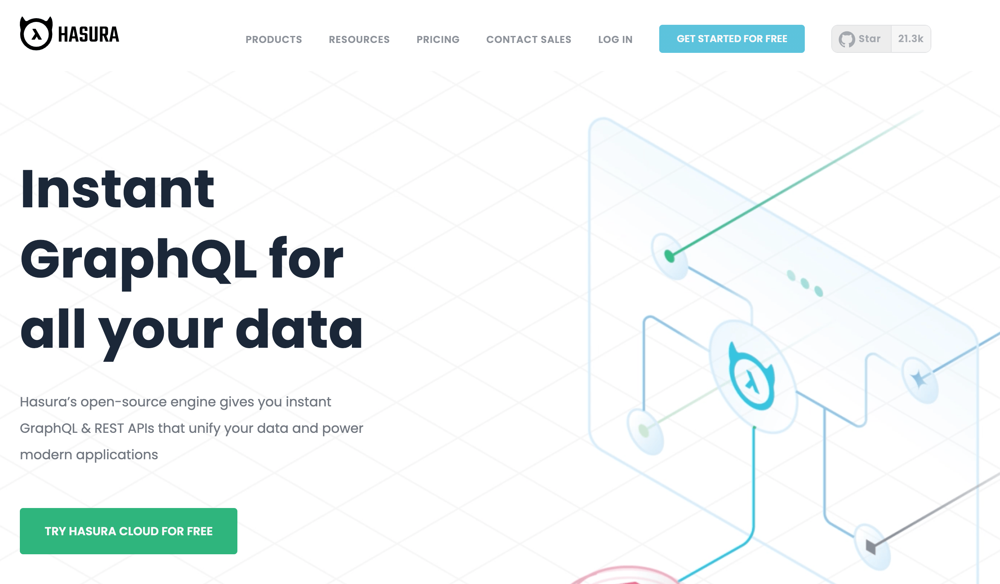
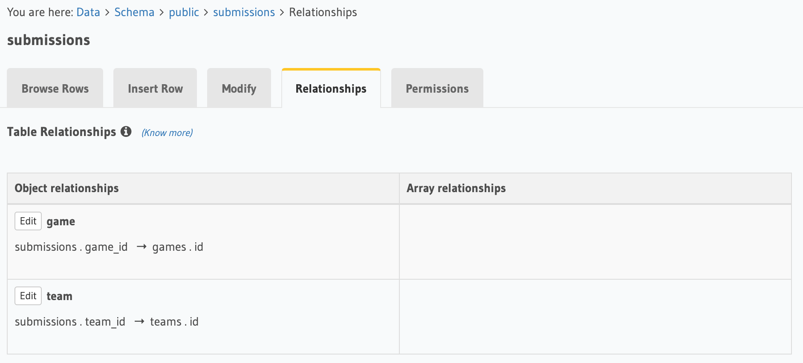
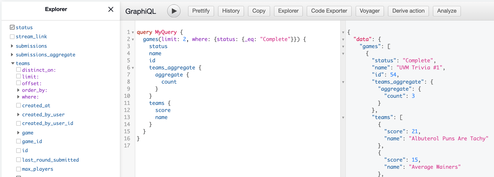
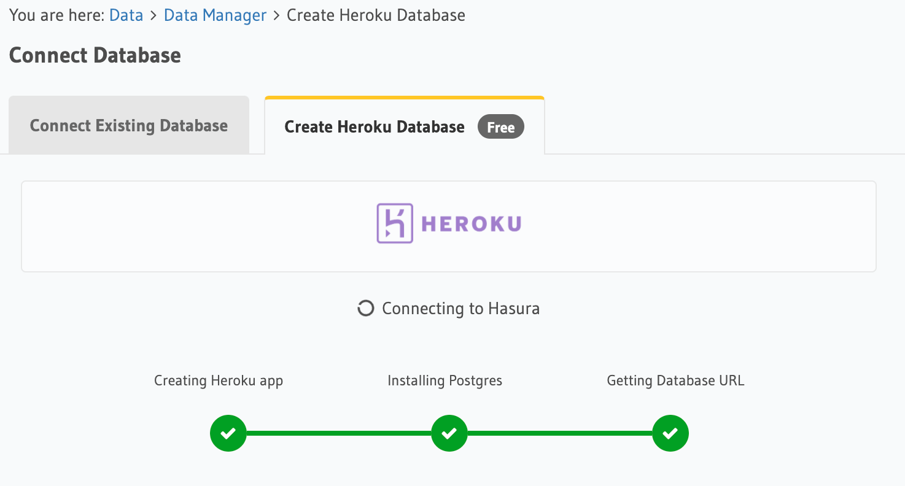
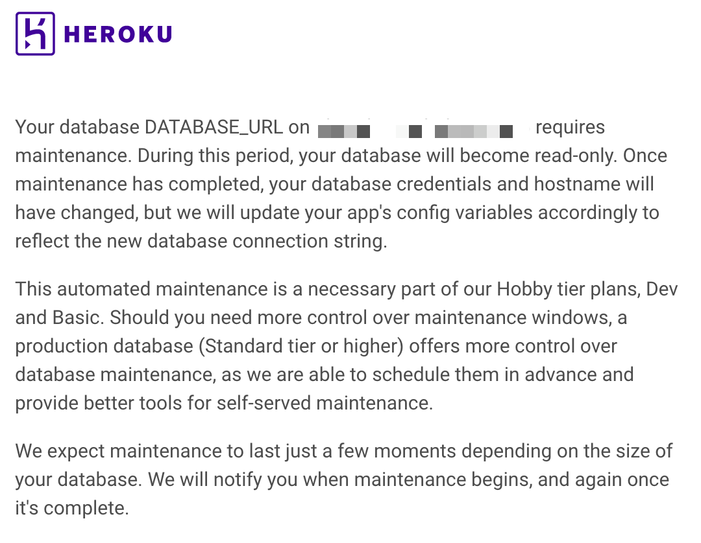

# Running Hasura On The Cheap
## What's Hasura?

Hasura is the company that created the [Hasura GraphQL Engine](https://github.com/hasura/graphql-engine#hasura-graphql-engine), a "blazing-fast GraphQL server that gives you instant, realtime GraphQL APIs over Postgres." (For this blog post, I may use "Hasura" and "Hasura GraphQL Engine" interchangeably because this post is about self-hosting their GraphQL engine. But Hasura the company offers more than just their GraphQL engine.)

You can use the Hasura GUI to create Postgres tables and easily do standard Postgres things like set:
* columns
* constraints
* primary/foreign/unique keys
* table relationships

All this data is then accessible through a single GraphQL endpoint. You can use the integrated [GraphiQL IDE](https://github.com/graphql/graphiql#overview) to write queries, mutations, and subscriptions. 

Additionally, there are more advanced features like [permissioning](https://hasura.io/docs/latest/graphql/core/auth/authorization/permission-rules.html), [custom SQL functions](https://hasura.io/docs/latest/graphql/core/databases/postgres/schema/custom-functions.html), [event triggers](https://hasura.io/docs/latest/graphql/core/event-triggers/index.html). Beyond their documentation, many of these topics are covered in [their extremely handy tutorials](https://hasura.io/learn/).

I've been building [Trivia.Digital](https://trivia.digital) with Hasura as my backend, and it's made it very simple to configure my database and make my data accessible over a real-time GraphQL API. It's [open-source](https://hasura.io/opensource/) and has [great documentation](https://hasura.io/docs/latest/graphql/core/index.html) and I highly recommend it! As a relative noob to both Postgres and GraphQL, its UI is more beginner-friendly than a tool like [PostGraphile](https://www.graphile.org/postgraphile/).

The biggest _potential_ downside of Hasura is that it can be relatively expensive for a hobbyist to use it for a side project. But it doesn't have to be that way! Because their GraphQL Engine is open-source, I've been running it on [DigitalOcean](https://www.digitalocean.com/) for just $5/month.

**This post explains how you, too, can run Hasura for $5/ month while avoiding some potential pitfalls.** _Caveat_: I am not an expert on any of these topics, so my apologies if I've gotten anything wrong. If you have any suggestions, please email me at bhollander823@gmail.com.

Of course, this low bill is only possible because so many companies offer free plans for small projects. A _huge_ thank you to a bunch of other companies that have free plans.

  
Expand this if you want to read more about the non-Hasura parts of my stack.

   
  I'm using a 1-5 ⭐ system for how highly I recommend each tool, and I've included some information about their financial situation so you can get a better sense of how likely they are to stick around. Hasura gets five stars from me (and they
  <a href="https://hasura.io/blog/announcing-our-series-b-25m-financing/" target="_blank">raised a Series B in September 2020</a>).
   
 ⭐⭐⭐⭐⭐ 
* [Vercel](https://vercel.com/) – Vercel is a "deployment and collaboration platform for frontend developers." I'm hosting my frontend with them. They are the creators of the [Next.js React framework](https://nextjs.org/) and also maintain [Geist](https://github.com/geist-org/react), a minimal React UI library that I also use in my project. They last raised a [Series B round](https://vercel.com/blog/series-b-40m-to-build-the-next-web) in December 2020.
* [GitHub](https://github.com/) – If you're reading this, you probably already know about GitHub. You can host your code on GitHub, open and review pull requests there, etc. Every deploy to my `main` branch on GitHub automatically triggers a new Vercel deploy. I'm most familiar with GitHub, but other people love [GitLab](https://about.gitlab.com/). They were [acquired by Microsoft in 2018](https://news.microsoft.com/announcement/microsoft-acquires-github/) for $7.5 billion.

⭐⭐⭐⭐
* [Stream](https://getstream.io/) – Stream is a tool that makes it easier to build scalable in-app chat and activity feeds. I'm using it so everyone in a game can talk to each other over text chat. They [announced a Series B round](https://getstream.io/blog/stream-series-b-funding-announcement/) in March 2021 and shortly after released [a free plan for small businesses](https://getstream.io/maker-account/).
* [Sentry](https://sentry.io/) – Sentry is an application monitoring platform so you can get alerted of any errors in your app. Dead simple to integrate through Vercel. They last raised [a Series D round](https://techcrunch.com/2021/02/18/app-monitoring-platform-sentry-gets-60-million-series-d-at-1-billion-valuation/) in February 2021. 
* [Heap](https://heap.io/) – Heap is a product analytics tool that makes it easy to capture and understand your product usage data. They raised a [Series C round](https://heap.io/blog/company/our-55-million-series-c) in July 2019.
* [Heroku](https://www.heroku.com/) – Heroku is a "cloud application platform" that makes it easy to deploy an app without spending too much time on infrastructure. I'm hosting my Postgres database with them. [Purchased by Salesforce](https://techcrunch.com/2010/12/08/breaking-salesforce-buys-heroku-for-212-million-in-cash/) in 2010.

⭐⭐⭐
* [Jitsi](https://jitsi.github.io/handbook/docs/dev-guide/dev-guide-iframe) – An open-source videochat platform. You can even run your videochats on their servers, for free! Less capable than some competitors (like Zoom, who now offer a [Video SDK](https://zoom.us/docs/en-us/video-sdk.html) that has a limited free plan) but incredible at the price point. Ownership has changed hands a bit, and was [last sold to 8×8 from Atlassian in 2018](http://social.techcrunch.com/2018/10/29/atlassian-sells-jitsi-an-open-source-videoconferencing-tool-it-acquired-in-2015-to-8x8/).
* [Auth0](https://auth0.com/) – An authentication provider that makes it easy enough to let users securely sign in to your app. It's very nice to not worry too much about security, has its own login page I can redirect users to, and easily integrates with social login providers like Google. I don't love their login page, so I might replace them with my own auth system. Very recently (March 2021) [sold to Okta for $6.5 billion](https://auth0.com/blog/okta-auth0-announcement/).

## Self-Hosting Hasura GraphQL Engine on DigitalOcean ($5/month)

While the [free tier of Hasura Cloud](https://hasura.io/pricing/) is perfect for development, you are limited to 60 requests/minute. That's _probably_ not going to be enough for a production app. To get unlimited requests, you need to upgrade to the Standard tier which starts at $99/month. Because my site is more of a hobby project, I sought out a cheaper way to run my project in production.

Helpfully, Hasura has documentation on how to [easily deploy their GraphQL Engine](https://hasura.io/docs/latest/graphql/core/deployment/deployment-guides/digital-ocean-one-click.html) to [DigitalOcean](https://www.digitalocean.com/), where a virtual machine with 1 GB memory and 25 GB disk will run you $5/month. Seems like a good deal to me! 

## Hosting a Postgres Database on Heroku (free)

Hasura additionally has a guide to [creating a DigitalOcean managed Postgres database](https://hasura.io/docs/latest/graphql/core/deployment/deployment-guides/digital-ocean-one-click.html#using-digitalocean-managed-postgres-database). But those start at a comparatively steep $15/month.

Thankfully, it's incredibly easy to create a free database hosted on [Heroku](https://www.heroku.com/) when you create a new Hasura project. For the low price of $0/month, you can store up to 1 GB across 10,000 rows. For $9/month, your storage limit increases to 10 GB across ten million rows.

You might now be thinking, "If I'm going to host my database on Heroku, why don't I just host Hasura GraphQL Engine on Heroku too?" Well, the approximate Heroku equivalent of a [DigitalOcean Droplet](https://www.digitalocean.com/products/droplets/) is called a "[dyno](https://www.heroku.com/dynos)," and a dyno that doesn't auto-sleep starts at $7/month and is generally a bit more expensive than the Droplet-equivalent. Still, Heroku is a "Platform as a Service" while DigitalOcean is "Infrastructure as a Service", so Heroku _does_ offer you additional features for your money if you choose to go that route.

## Syncing Your Heroku Database URL with Your Self-Hosted Hasura GraphQL Engine

### Why You Need This

There is own major downside to a free Heroku database, however: maintenance. After maintenance, your database credentials change. *So, you must update your database credentials in your self-hosted Hasura GraphQL Engine so your app can continue to connect to your database.*

Hasura Cloud offers "[Heroku URL Sync](https://hasura.io/docs/latest/graphql/cloud/projects/heroku-url-sync.html)" to keep your project's `HEROKU_DATABASE_URL` in sync. *Unfortunately*, this feature is only available for Hasura Cloud users. *Fortunately*, I'm about to tell you how to build this feature for your self-hosted Heroku.

### Creating the Webhook Server

Use: https://github.com/adnanh/webhook

Run `webhook` with 
`webhook -hooks /path/to/hooks.json -secure -cert public.crt -key private.key -ip "your.domain" -port 9003`

TODO

